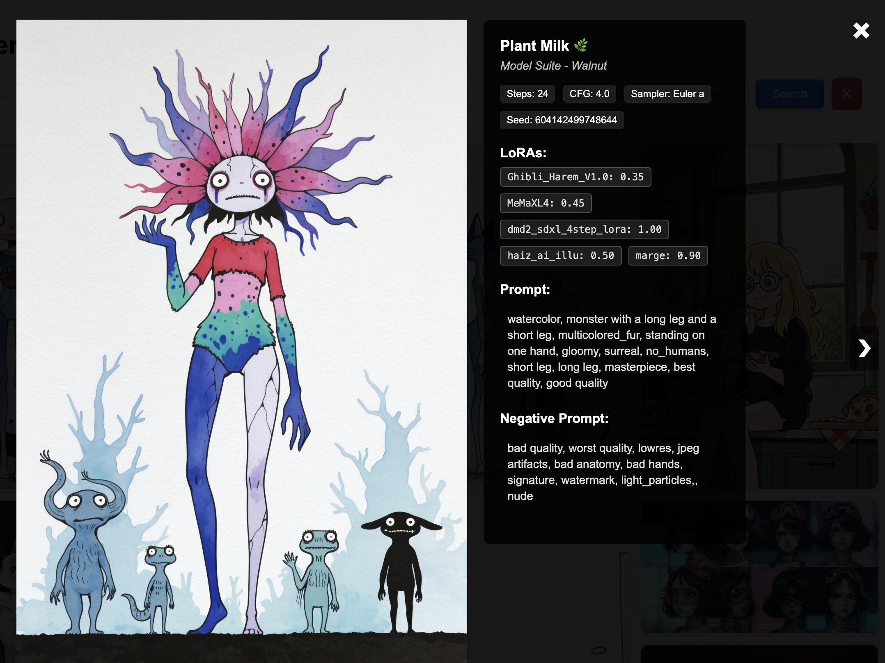

# AI Generated Image Viewer

A web-based viewer for AI-generated images with metadata display, search functionality, and Civitai API integration.




## Features

One of my usage of Civitai is to save the generated image I like, and I fear the website won't last forever given recent events. This app has 2 goals : 

1. **Local Image Viewer**: View and manage your AI-generated images locally with metadata display. You just need to put images in the images folder, and on next start they will be imported in the sqlite database, and viewable / searchabale in a clean interface. The SQLLite database only act as a cache, so you can wipe it anytime you want.
2. **Civitai Import**: Import images and prompts from Civitai, allowing you to backup your favorite AI-generated content locally. It will download the images, and save the prompts to txt file. I use the prompts file in ComfyUI, picking a random prompt from my past image when I lack inspiration / want to test a new model. 


## Download

### Pre-built Binaries

Download the latest release for your platform:

- **Windows**: [ai-generated-image-viewer-windows-amd64.zip](../../releases/latest/download/ai-generated-image-viewer-windows-amd64.zip)
- **macOS (Intel)**: [ai-generated-image-viewer-macos-amd64.tar.gz](../../releases/latest/download/ai-generated-image-viewer-macos-amd64.tar.gz)
- **macOS (Apple Silicon)**: [ai-generated-image-viewer-macos-arm64.tar.gz](../../releases/latest/download/ai-generated-image-viewer-macos-arm64.tar.gz)
- **Linux**: [ai-generated-image-viewer-linux-amd64.tar.gz](../../releases/latest/download/ai-generated-image-viewer-linux-amd64.tar.gz)

> **Note**: No installation required! Just download, extract, and run.

### Build from Source

Requirements: [mise](https://mise.jdx.dev/) and the [1Password CLI](https://developer.1password.com/docs/cli/)

```bash
git clone https://github.com/your-username/ai-generated-image-viewer.git
cd ai-generated-image-viewer
cp .env.op.example .env.op
# Edit .env.op with the secret references copied from 1Password.
mise trust
mise run dev
```

`mise run dev` installs the declared Go, Air, and 1Password CLI versions when needed, downloads and verifies the Go modules, injects `XAI_API_KEY` and `CIVITAI_TOKEN` for the child process with `op run`, then starts Air. The resolved secret values are never written to the project.

The local `.env.op` should contain references matching your vault and item names:

```dotenv
XAI_API_KEY="op://<vault>/<xai-item>/<field>"
CIVITAI_TOKEN="op://<vault>/<civitai-item>/<field>"
```

Non-secret import settings such as `CIVITAI_USERNAME` and `AUTO_IMPORT_ON_STARTUP` can remain in `civitai.config`. Injected environment variables take precedence over values in that file, so its old `CIVITAI_TOKEN` entry can be removed after verifying the new development command.

## Quick Start

1. **Download** the binary for your platform
2. **Extract** the archive
3. **Run** the application:
   ```bash
   # Windows
   ai-generated-image-viewer-windows-amd64.exe
   
   # macOS/Linux
   ./ai-generated-image-viewer-macos-amd64
   ```
4. **Open** your browser to `http://localhost:8081`

## Usage

### Web Interface

- Place your AI-generated images in the `images/` directory
- NSFW images can be placed in `images_nsfw/` directory
- Start the application and navigate to `http://localhost:8081`
- Use the search bar to find images by prompt content
- Filter by model or NSFW status. The NSFW filter is hidden behind a shortcut, CTRL+d.
- Click images to view full size with metadata
- From the image viewer, click **Gen prompt**, choose the Anima or Krea 2 output format, select Describe/Remix/Next/Before, and optionally steer the result before generating it

### Prompt generation

Prompt remixing uses an OpenAI-compatible chat-completions endpoint. xAI Grok is the default provider, but the API URL and model are configurable:

```bash
XAI_API_KEY=your_api_key ./ai-generated-image-viewer

# Generic provider configuration (takes precedence over the XAI_* aliases)
PROMPT_LLM_API_KEY=your_api_key \
PROMPT_LLM_BASE_URL=https://api.example.com/v1 \
PROMPT_LLM_MODEL=provider-model-name \
PROMPT_LLM_REASONING_EFFORT=medium \
./ai-generated-image-viewer
```

The available variables are:

- `PROMPT_LLM_API_KEY`: provider API key; falls back to `XAI_API_KEY`
- `PROMPT_LLM_BASE_URL`: OpenAI-compatible API base URL; falls back to `XAI_BASE_URL`, then `https://api.x.ai/v1`
- `PROMPT_LLM_MODEL`: chat model; falls back to `XAI_MODEL`, then `grok-4.5`
- `PROMPT_LLM_REASONING_EFFORT`: reasoning level; falls back to `XAI_REASONING_EFFORT`, then `medium`

Prompt instructions are composed from two independent layers. [`prompt_systems/anima.md`](prompt_systems/anima.md) and [`prompt_systems/krea-2.md`](prompt_systems/krea-2.md) define the target model's output format, while [`prompt_systems/concepts/`](prompt_systems/concepts/) contains the Describe, Remix, Next, and Before creative operations. Optional steering from the form is sent separately as user direction. All instruction files are read for every generation request, so edits take effect immediately without recompiling or restarting the server.

Each generation also sends the source image as a visual reference. The server resizes it in memory to a maximum of 1536px, encodes it as JPEG, and uses the provider's automatic image-detail setting; the original file is never modified. The server logs the returned text, image, completion, and reasoning token counts after each request so API usage can be measured directly.

### Prompt generation from ComfyUI

The same prompt generation is available for images that are not in the library, through the ComfyUI custom node in [`comfyui/civitai_prompt_bridge/`](comfyui/civitai_prompt_bridge/). Copy that directory into ComfyUI's `custom_nodes` folder, connect the rendered image and its prompt to the node, and click its **Generate prompt** button; see the [node README](comfyui/civitai_prompt_bridge/README.md) for the details.

It talks to `POST /api/comfy/generate-prompt`, which takes the image inline instead of an image ID:

```bash
curl -X POST http://localhost:8081/api/comfy/generate-prompt \
  -H 'Content-Type: application/json' \
  -d '{
    "prompt": "a cat sitting on a windowsill",
    "image_base64": "<base64 JPEG or PNG, data URLs accepted>",
    "target_model": "krea-2",
    "concept": "next",
    "steering": "two seconds later"
  }'
```

The response is `{"prompt": "..."}`, or `{"error": "..."}` with a non-200 status. `image_base64` and `prompt` are both optional as long as one of them is provided, and the image goes through the same 1536px JPEG normalization as library images. This route is unauthenticated and meant for a trusted local network only.

### Civitai Import

Import images and prompts directly from Civitai:

1. **Create config file**:
   ```bash
   cp civitai.config.example civitai.config
   ```

2. **Edit `civitai.config`**:
   ```
   CIVITAI_TOKEN=your_api_token
   CIVITAI_USERNAME=target_username
   ```

3. **Run import**:
   ```bash
   ./ai-generated-image-viewer -import-civitai
   ```

### Command Line Options

```bash
./ai-generated-image-viewer                # Run web server
./ai-generated-image-viewer -import-civitai # Import from Civitai
./ai-generated-image-viewer -clear-images  # Clear database
./ai-generated-image-viewer -help          # Show help
```

## Configuration

### Environment Variables

- `CIVITAI_TOKEN`: API token for Civitai (get from [civitai.com/user/account](https://civitai.com/user/account))
- `CIVITAI_USERNAME`: Username to import images from
- `PROMPT_LLM_API_KEY`: API key for prompt generation (or use `XAI_API_KEY`)
- `PROMPT_LLM_BASE_URL`: OpenAI-compatible API base URL
- `PROMPT_LLM_MODEL`: model used to remix prompts
- `PROMPT_LLM_REASONING_EFFORT`: reasoning level used for prompt generation

### Directory Structure

```
ai-generated-image-viewer/
├── images/                # SFW images
├── images_nsfw/           # NSFW images  
├── thumbnails/            # Auto-generated thumbnails
├── images.db              # SQLite database
├── prompts_sfw.txt        # SFW prompts (import output)
├── prompts_nsfw.txt       # NSFW prompts (import output)
├── prompt_systems/        # Editable system prompts for prompt remixing
├── excluded_words.txt     # Words to exclude from prompts files
└── civitai.config         # Civitai import configuration
```

## Technical Details

- **Backend**: Go with Gorilla Mux and SQLite
- **Frontend**: HTMX with vanilla CSS
- **Image Processing**: Automatic thumbnail generation and EXIF parsing
- **Database**: SQLite with automatic schema creation
- **API**: RESTful endpoints for search and pagination

## Code Signing

The binaries are not code-signed. On first run:

- **Windows**: Windows Defender may show a warning - click "More info" → "Run anyway"
- **macOS**: Right-click the binary → "Open" → "Open" to bypass Gatekeeper

## Contributing

1. Fork the repository
2. Create your feature branch (`git checkout -b feature/amazing-feature`)
3. Commit your changes (`git commit -m 'Add amazing feature'`)
4. Push to the branch (`git push origin feature/amazing-feature`)
5. Open a Pull Request

## License

This project is open source and available under the [MIT License](LICENSE).
