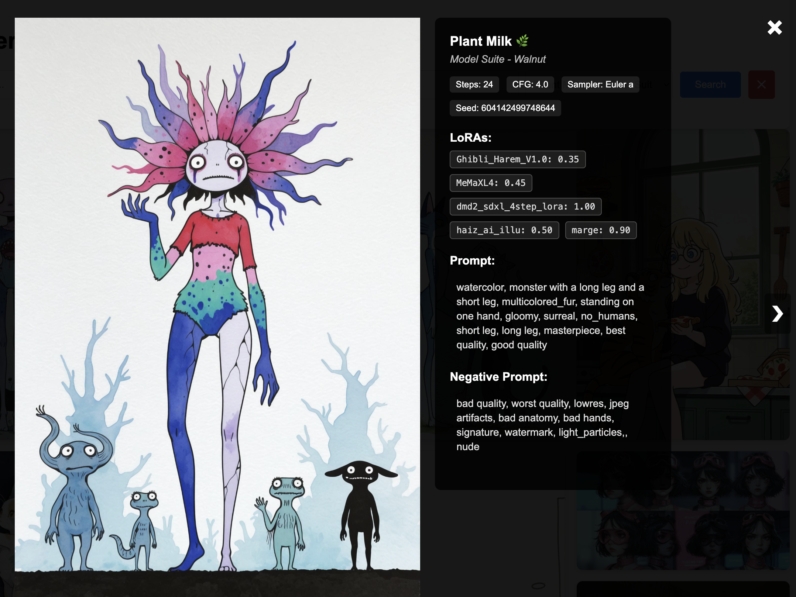

# AI Generated Image Viewer

A web-based viewer for AI-generated images with metadata display, search functionality, and Civitai API integration.




## Features

One of my usage of Civitai is to save the generated image I like, and I fear the website won't last forever given recent events. This app has 2 goals : 

1. **Local Image Viewer**: View and manage your AI-generated images locally with metadata display. You just need to put images in the images folder, and on next start they will be imported in the sqlite database, and viewable / searchabale in a clean interface. The SQLLite database only act as a cache, so you can wipe it anytime you want.
2. **Civitai Import**: Import images and prompts from Civitai, allowing you to backup your favorite AI-generated content locally. It will download the images, and save the prompts to txt file. I use the prompts file in ComfyUI, picking a random prompt from my past image when I lack inspiration / want to test a new model. 


## Download

### Pre-built Binaries

Download the latest release for your platform:

- **Windows**: [ai-generated-image-viewer-windows-amd64.zip](../../releases/latest/download/ai-generated-image-viewer-windows-amd64.zip)
- **macOS (Intel)**: [ai-generated-image-viewer-macos-amd64.tar.gz](../../releases/latest/download/ai-generated-image-viewer-macos-amd64.tar.gz)
- **macOS (Apple Silicon)**: [ai-generated-image-viewer-macos-arm64.tar.gz](../../releases/latest/download/ai-generated-image-viewer-macos-arm64.tar.gz)
- **Linux**: [ai-generated-image-viewer-linux-amd64.tar.gz](../../releases/latest/download/ai-generated-image-viewer-linux-amd64.tar.gz)

> **Note**: No installation required! Just download, extract, and run.

### Build from Source

Requirements: Go 1.21+

```bash
git clone https://github.com/your-username/ai-generated-image-viewer.git
cd ai-generated-image-viewer
go build -o ai-generated-image-viewer
```

## Quick Start

1. **Download** the binary for your platform
2. **Extract** the archive
3. **Run** the application:
   ```bash
   # Windows
   ai-generated-image-viewer-windows-amd64.exe
   
   # macOS/Linux
   ./ai-generated-image-viewer-macos-amd64
   ```
4. **Open** your browser to `http://localhost:8081`

## Usage

### Web Interface

- Place your AI-generated images in the `images/` directory
- NSFW images can be placed in `images_nsfw/` directory
- Start the application and navigate to `http://localhost:8081`
- Use the search bar to find images by prompt content
- Filter by model or NSFW status. The NSFW filter is hidden behind a shortcut, CTRL+d.
- Click images to view full size with metadata

### Civitai Import

Import images and prompts directly from Civitai:

1. **Create config file**:
   ```bash
   cp civitai.config.example civitai.config
   ```

2. **Edit `civitai.config`**:
   ```
   CIVITAI_TOKEN=your_api_token
   CIVITAI_USERNAME=target_username
   ```

3. **Run import**:
   ```bash
   ./ai-generated-image-viewer -import-civitai
   ```

### Command Line Options

```bash
./ai-generated-image-viewer                # Run web server
./ai-generated-image-viewer -import-civitai # Import from Civitai
./ai-generated-image-viewer -clear-images  # Clear database
./ai-generated-image-viewer -help          # Show help
```

## Configuration

### Environment Variables

- `CIVITAI_TOKEN`: API token for Civitai (get from [civitai.com/user/account](https://civitai.com/user/account))
- `CIVITAI_USERNAME`: Username to import images from

### Directory Structure

```
ai-generated-image-viewer/
├── images/                # SFW images
├── images_nsfw/           # NSFW images  
├── thumbnails/            # Auto-generated thumbnails
├── images.db              # SQLite database
├── prompts_sfw.txt        # SFW prompts (import output)
├── prompts_nsfw.txt       # NSFW prompts (import output)
├── excluded_words.txt     # Words to exclude from prompts files
└── civitai.config         # Civitai import configuration
```

## Technical Details

- **Backend**: Go with Gorilla Mux and SQLite
- **Frontend**: HTMX with vanilla CSS
- **Image Processing**: Automatic thumbnail generation and EXIF parsing
- **Database**: SQLite with automatic schema creation
- **API**: RESTful endpoints for search and pagination

## Code Signing

The binaries are not code-signed. On first run:

- **Windows**: Windows Defender may show a warning - click "More info" → "Run anyway"
- **macOS**: Right-click the binary → "Open" → "Open" to bypass Gatekeeper

## Contributing

1. Fork the repository
2. Create your feature branch (`git checkout -b feature/amazing-feature`)
3. Commit your changes (`git commit -m 'Add amazing feature'`)
4. Push to the branch (`git push origin feature/amazing-feature`)
5. Open a Pull Request

## License

This project is open source and available under the [MIT License](LICENSE).